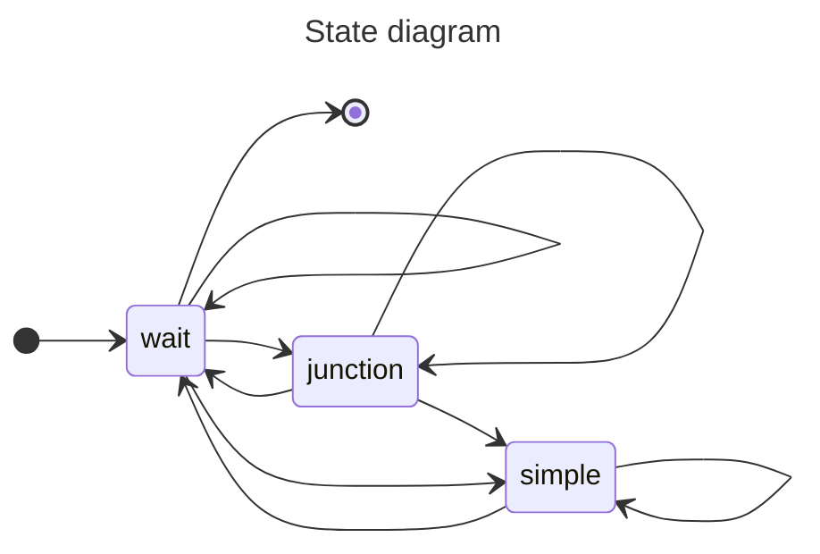

# Version 07: multiple agents and simplifying the environment
> In this version, we include support for multiple agents.  We also introduce a new representation of the environment by eliminating groups of cells known as _straightaways_ which are long stretches of track, wherein no decision can be made by the agent because it is only permitted to move forward.

## Files
* `test_env.lp` a small environment for testing simple scenarios
* `transitions.lp` a reference file describing possible transitions per track type
* `class.lp` a reference file classifying track types and allowable moves (see below)
* `encoding.lp` computes valid paths
* `actions.lp` converts paths (solution from `encoding.lp`) into sequences of Flatland actions
* `class.lp` a reference file describing 

## Track classes
Tracks can belong to one of three classes: **junction**, **wait**, or **simple**.

### Junction
`Possible actions: move forward, turn left, turn right`

A **junction** is any cell of type 2, 4, 5, or 6 that presents a choice for the agent from at least one direction.  Waiting is not allowed here, as this may interfere with other agents' paths.
 

### Wait
`Possible actions: wait, move forward`

A **wait** is any non-switch cell that precedes a **junction** or a diamond crossing.  This allows the agent to complete a partial path before reaching a **junction**, without blocking the **junction** and therefore potentially interfering with paths of other agents.  Furthermore, starting and ending cells are including in this class.  Because of this, the first and last cell of any complete path will be a **wait**.
 

### Simple
`Possible actions: move forward`

A **simple** is any remaining cell of the remaining track types which permits the agent to make no directional decision other than moving forward.
 

### State diagram
Here is diagram outlining the possible state changes between track classes:

