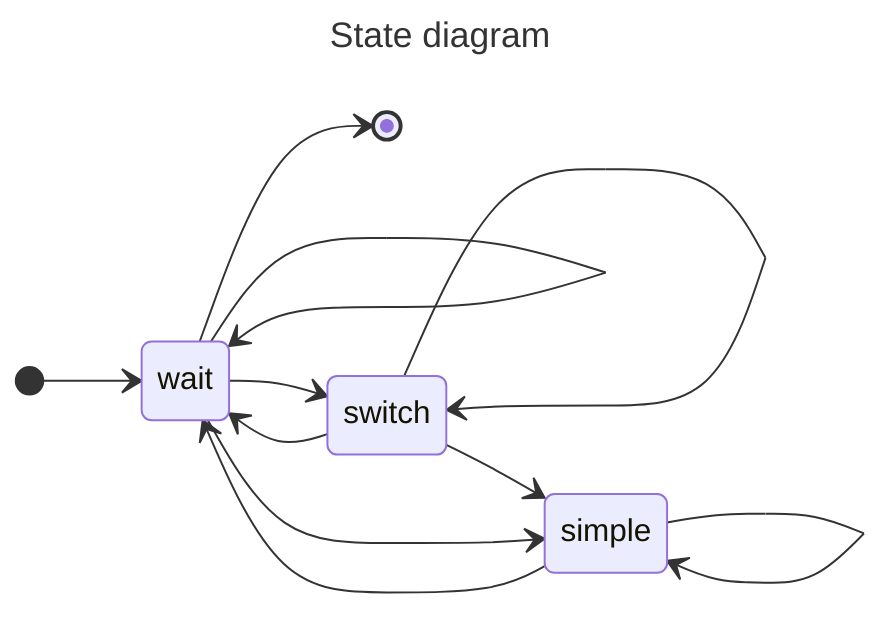

# Version 07
> In this version, we introduce a new representation of the environment by eliminating groups of cells known as _straightaways_ which are long stretches of track, wherein no decision can be made by the agent because it is only permitted to move forward.

## Track classes
From the perspective of an agent, tracks can belong to one (and only one) of three classes: **switch**, **wait**, or **simple**.

### Switch
`Possible actions: move forward, turn left, **turn right**`

A **switch** is any cell of type 2, 4, 5, or 6 that presents a choice for the agent from its orientation.  When an agent encounters a **switch**, it will always be faced with exactly two decisions.
If an agent approaches this type of cell from a direction which does not provide a choice for the agent, it would be considered **simple**.
 

### Wait
`Possible actions: wait, move forward`

A **wait** is any non-switch cell that precedes a **switch**.  This allows the agent to complete a path before reaching a switch, without blocking the **switch** and therefore potentially interfering with paths of other agents.  Furthermore, starting and ending cells are including in this class.  Because of this, the first and last cell of any path will be a **wait**.
 

### Simple
`Possible actions: move forward`

A **simple** is any remaining cell of any track type which permits the agent to make no directional decision other than moving forward.
 

### State diagram
Here is diagram outlining the possible state changes between track classes:

